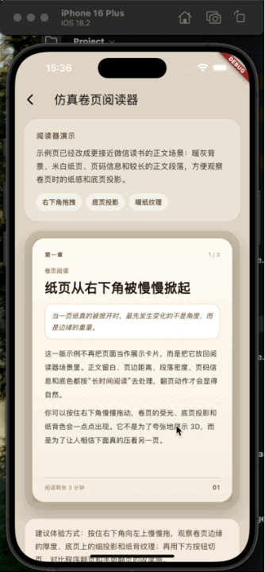

# book_page_switcher_demo

Flutter 仿真卷页翻页 Demo，通过单侧翻页、纸张背面、底页投影、卷痕高光和页边厚度来模拟接近阅读器的卷页体验。当前仓库是一个可直接运行的示例应用，核心组件位于 `lib/src/widgets/hs_book_page_switcher.dart`。

## 展示图


## 项目概览

这个项目不是通用脚手架，而是围绕一个“仿真翻书切页组件”搭建的最小演示：

- `lib/main.dart`
  应用入口，启动 `BookPageSwitcherPage`
- `lib/src/pages/book_page_switcher_page.dart`
  Demo 页面，构造了 3 页阅读内容，并演示按钮切页、页码切换和循环翻页
- `lib/src/widgets/hs_book_page_switcher.dart`
  核心组件与控制器实现，包含手势识别、翻页动画、裁剪路径和纸张质感绘制
- `test/widget_test.dart`
  基础 smoke test，验证页面可渲染且“下一页”按钮可触发切换

## 核心特性

- 支持前进翻页和后退翻页
- 支持手势拖拽翻页与代码控制翻页
- 支持 `nextPage`、`previousPage`、`animateToPage`、`jumpToPage`
- 支持循环翻页 `enableLoop`
- 支持页码变化回调 `onPageChanged`
- 可配置翻页时长、透视强度、纸背颜色、阴影颜色、外层装饰与裁剪方式
- 通过 `Transform`、`ClipPath`、`CustomPainter` 组合模拟纸张背面、卷痕、底页阴影和页边厚度

## 交互行为

- 从右下区域向左上拖拽时，触发“下一页”
- 从左下区域向右上拖拽时，触发“上一页”
- 非拖拽状态下，快速横向甩动也可以触发翻页
- 手势翻页与代码翻页的收尾逻辑不同：
  手势翻页会保留最后一次拖拽形成的卷角位置，程序翻页则使用更规整的内置动画

## 组件用法

下面的示例基于当前仓库的组件接口，适合直接复制到本项目中验证：

```dart
final HsBookPageController controller = HsBookPageController();

HsBookPageSwitcher(
  controller: controller,
  enableLoop: true,
  duration: const Duration(milliseconds: 560),
  paperBackColor: const Color(0xFFF3EADC),
  shadowColor: const Color(0x332A1F16),
  onPageChanged: (int index) {
    debugPrint('current page: $index');
  },
  decoration: BoxDecoration(
    color: const Color(0xFFF7F0E4),
    borderRadius: BorderRadius.circular(26),
  ),
  children: const <Widget>[
    Placeholder(),
    Placeholder(),
    Placeholder(),
  ],
)
```

控制器可用方法：

- `animateToPage(int page)`：带动画跳转到指定页
- `jumpToPage(int page)`：直接跳转到指定页
- `nextPage()`：切到下一页
- `previousPage()`：切到上一页

## 主要参数

| 参数 | 说明 |
| --- | --- |
| `children` | 页面列表，不能为空 |
| `controller` | 外部翻页控制器 |
| `initialPage` | 初始页下标 |
| `onPageChanged` | 页码变化回调 |
| `enableGesture` | 是否开启手势翻页 |
| `enableLoop` | 是否允许首尾循环翻页 |
| `duration` | 翻页动画时长 |
| `perspective` | 3D 透视强度 |
| `dragVelocityThreshold` | 甩动翻页的速度阈值 |
| `paperBackColor` | 纸张背面颜色 |
| `shadowColor` | 阴影主色 |
| `decoration` | 外层容器装饰 |
| `clipBehavior` | 外层裁剪方式 |

## 实现说明

组件的动画并不是简单的页面切换，而是拆成了几层同时渲染：

1. 底页：显示目标页并叠加轻微受光和投影
2. 当前页：按翻页曲线裁剪剩余可见区域
3. 卷起页条：使用 `Transform` 做 3D 翻折，切换正面/背面材质
4. 细节层：卷痕高光、纸张纹理、页边厚度和局部阴影

这套实现比较适合小说阅读、故事介绍页、作品集引导页之类需要“纸张感”的场景。

## 已知限制

- 当前仓库是 demo app，不是已经发布到 pub.dev 的独立 package
- 最佳效果依赖相对稳定的页面尺寸，建议放在固定宽高比容器中使用
- 每一帧会涉及多层 `ClipPath` 和 `CustomPainter`，复杂子页面过多时需要关注性能
- `curve` 参数虽然在组件构造函数中存在，但当前内部动画实际使用的是固定曲线 `_kBookTurnForwardCurve` 和 `_kBookTurnRollbackCurve`
